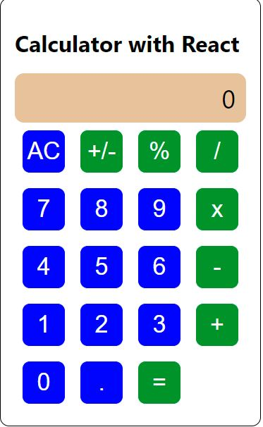

# REACT CALCULATOR APP
### React calculator simple and advance calculator to help speed up calculations with variety of maths options, Almost any mathematical equation can be computed. 

  

## Screenshot


## Live Demo 

[Clic here](https://calculator-machine.herokuapp.com/)
## Built With

- [JavaScript ES6](https://www.javascript.com/) 
- [React](https://reactjs.org/)
- [create-react-app](https://github.com/facebook/create-react-app)
- HTML and CSS
- [NPM](https://www.npmjs.com/)
- ESLint
- StyleLint

## Packages
- [BigJS](https://github.com/MikeMcl/big.js/)
- [PropTypes](https://www.npmjs.com/package/prop-types)

## Prerequisities

To get this project up and running locally, you must follow the steps from the [getting started section](#getting-started).

## Getting Started

**To get this project set up on your local machine, follow these simple steps:**

**Step 1**<br>
Navigate through the local folder where you want to clone the repository and run<br>
git clone `https://github.com/billodiallo/Calculator.git`. It will clone the repo to your local folder.<br>

**Step 2**<br>
- Cd inside the project

- run npm install

### Run project 

`` npm run start ``

open ```localhost:3000``` in browser. 


## 🤝 contributing

Contributions, issues and feature requests are welcome!

## Author

👤 Billo Dallio

- GitHub: [@billodiallo](https://github.com/billodiallo)
- Twitter: [@BilloDi83547008](https://twitter.com/BilloDi83547008)
- LinkedIn: [Billo Diallo](https://www.linkedin.com/in/mabillodiallo/)

## 🙋‍♂ show your support

give a ⭐️ if you like this project!

## 📝 license


This project is [MIT](LICENSE) licensed.

